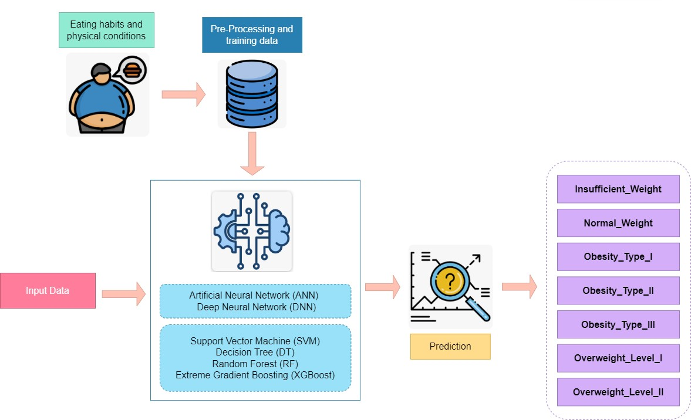

# 🍔🍟🍕 Obesity Risk Prediction App

This Streamlit app predicts the risk of obesity based on various input features.

## 📝 Overview

The Obesity Risk Prediction App is a simple tool developed using Streamlit, a Python library for building web applications. It utilizes a machine learning model trained on a dataset of individuals' characteristics and their corresponding obesity levels to predict the risk of obesity for a given set of input features.



## ✨ Features

- 📊 Predicts the risk of obesity based on user input.
- 📋 Provides explanations for each input feature.
- 👁️‍🗨️ Allows users to easily understand and interpret the predictions.

## 🛠️ Installation

1. Clone this repository to your local machine.
2. Install the required packages by running:
    ```bash
    pip install -r requirements.txt
    ```

## 🚀 Usage

1. Navigate to the directory containing the app files.
2. Run the app using the following command:
    ```bash
    streamlit run predictionApp.py
    ```

3. 🌐 Access the app in your web browser at the provided URL.

## 📥 Input Features

- 📝 Fill in the input fields with relevant information for the individual whose obesity risk you want to predict.
- 🎛️ Select options from the dropdown menus or use sliders for numerical inputs.

The app accepts the following input features:

- 🏠 Family history with overweight
- 🎂 Age
- 🍽️ Consumption of food between meals
- 💧 Consumption of water daily
- 🍎 Calories consumption monitoring
- 🍴 Number of main meals
- 🍷 Consumption of alcohol
- 🍰 Frequent consumption of high caloric food
- 📏 Height
- 🥦 Frequency of consumption of vegetables
- ⚖️ Weight
- 🧍 Gender

**🔮 Prediction:**
- Click the "Predict" button to obtain the predicted obesity risk class based on the provided features.
- The predicted class will be displayed below the input fields.

**🔄 Clear Results:**
- To clear the prediction results, click the "Clear Results" button.

## 📤 Output

The app provides the predicted class label indicating the risk of obesity based on the input features.

## 🛠️ Built With

- [Python](https://www.python.org/) - The programming language used.
- [Streamlit](https://streamlit.io/) - The app framework used.
- [Scikit-learn](https://scikit-learn.org/stable/) - Machine learning library for model training and prediction.
